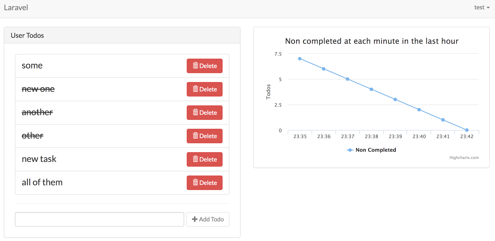

# WS-Todo Coding Challenge



Requirements:
- VirtualBox: https://www.virtualbox.org/wiki/Downloads
- Vagrant: https://www.vagrantup.com/downloads.html

## Installation Steps

#### 1. Clone the repo
```bash
git clone git@github.com:ezerw/ws-todo.git
```

#### 2. Install dependencies
```bash
composer install
npm install
```

#### 3. Compile assets
```bash
npm run dev 
```

#### 4. Add the .env config file and generate the key
```
cp .env.example .env
php artisan key:generate
```

#### 5. Set the VM config
```bash
php vendor/bin/homestead make
```

#### 6. Add the host to your hosts file
```bash
sudo vim /etc/hosts

```
and add the line

```bash
192.168.10.10 homestead.app
```

#### 7. Download and bootstrap the Vagrant box
```bash
vagrant up
```

#### 8. SSH in the VM
```bash
vagrant ssh
```

#### 9. Migrate the Database
```bash
php artisan migrate
```

#### 10. Initialize worker in the default queue
```bash
php artisan queue:work redis
```

#### 11. Add Cron entry (set the correct project path)
```bash
* * * * * /usr/bin/php /path-to-project/artisan schedule:run >> /dev/null 2>&1
```

#### 12. Visit http://homestead.app


### Tests
Run `phpunit` from the project root inside the vm
